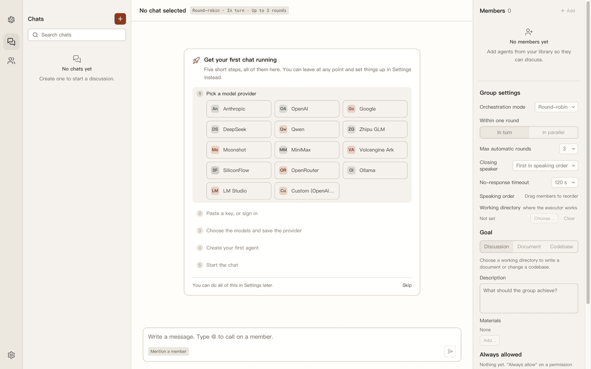
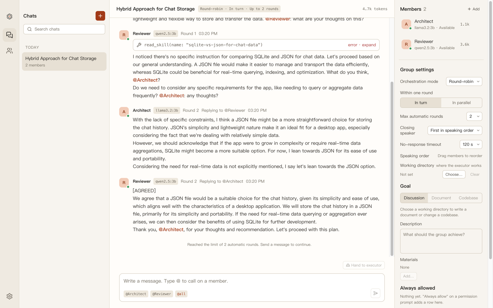
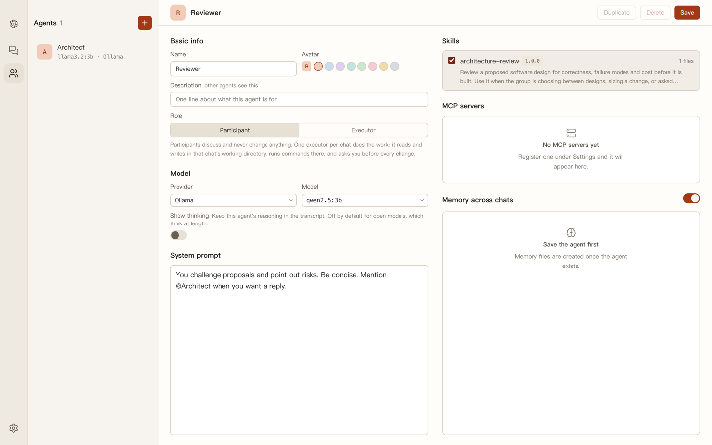
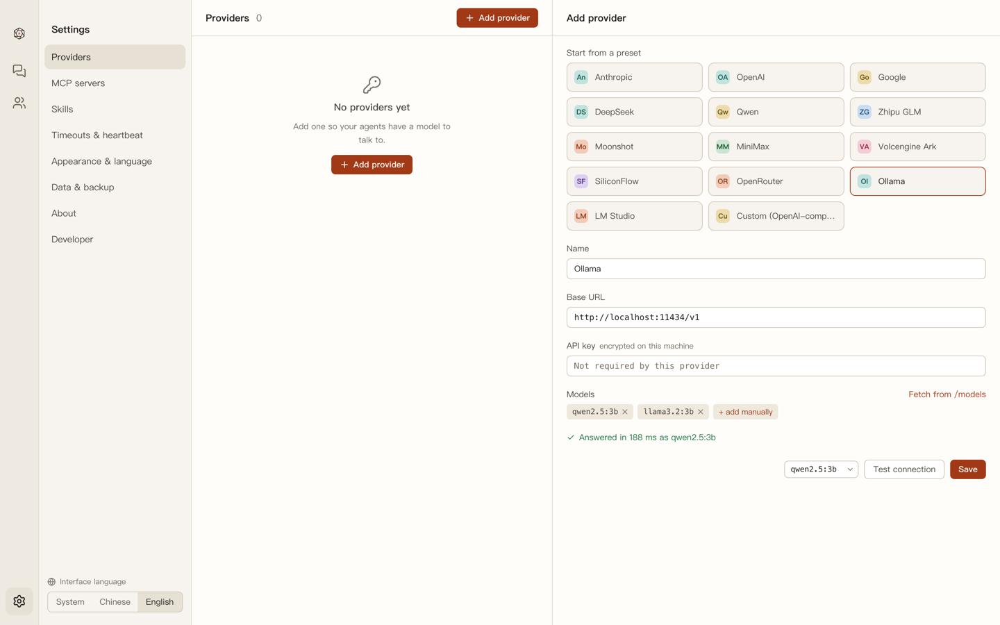

# Witena

A macOS desktop app where several AI agents — each on its own model — discuss
your problem in one group chat.



## Why

One model gives you one opinion. Witena puts several in the same room, lets them
read each other's answers and reply to each other by name, so disagreement
surfaces before you act on it. Closed models (Anthropic, OpenAI, Google), Chinese
providers (DeepSeek, Qwen, Zhipu, Moonshot, ...) and local open models through
Ollama or LM Studio all sit at the same table. Each agent is configured
separately: its own system prompt, its own skills, its own MCP tools and its own
memory that carries across chats.

## Features

- **Group chat with two modes** — round-robin (everyone answers) or mention-only
  (only the agents you `@` do). A reply that `@`s another member schedules the
  next round, up to a limit you set.
- **Sequential or parallel rounds** — sequential lets later speakers read earlier
  ones; parallel streams every member at once behind a round barrier, so nobody
  starts round *n+1* while round *n* is still going.
- **Presence dots and timeouts** — green available, red working, orange stalled,
  grey offline. A member that goes silent past the hard timeout is aborted,
  marked skipped, and the round continues without it.
- **Providers** — Anthropic, OpenAI, Google and any OpenAI-compatible endpoint,
  with presets for DeepSeek, Qwen (DashScope), Zhipu, Moonshot, MiniMax,
  Volcengine Ark, SiliconFlow, OpenRouter, Ollama and LM Studio. Keys are
  encrypted with the system keychain before they are stored.
- **MCP tools** — stdio and Streamable HTTP servers, discovered lazily and shown
  as tool cards in the transcript. Servers flagged as having side effects are
  **not** attached to discussion agents: participants get read-only tools, and
  every write is left to a single executor agent (see the roadmap).
- **Agent Skills** — drop a `SKILL.md` folder in, tick it on an agent, and the
  agent pulls the full text with `read_skill` only when it needs it.
- **Memory** — per-agent markdown notes with a `MEMORY.md` index, written by the
  agent with `memory_save` and readable and editable by hand.
- **Bilingual UI** — English and Simplified Chinese, switchable without a
  restart. The briefing injected into the models follows the UI language.
- **Local first** — one SQLite file in the app's data directory. No account, no
  server, nothing leaves the machine except the model calls you configured.

## Screenshots

**The chat** — two agents mid-discussion, one of them calling a memory tool.
Round and speaking mode in the header, presence dots and per-member token counts
on the right.



**The agents** — one form per agent: model, parameters, system prompt, the
skills it may read, the MCP servers it may call, and its memory.



**The settings** — providers from a preset, models fetched or typed, and a
connection test that says how long the endpoint took to answer.



## Getting started

Requirements: macOS, Node 24, and — optionally —
[Ollama](https://ollama.com) if you want to run models locally. Apple silicon is
what the app is developed and tested on; an Intel dmg is built from the same
source but has not been run on Intel hardware.

```sh
npm install          # rebuilds better-sqlite3 for Electron via postinstall
npm run dev          # Vite dev server + Electron with HMR
npm test             # vitest
npm run e2e          # Playwright driving the real Electron build (needs Ollama)
npm run dist         # → dist/Witena-<version>-{arm64,x64}.dmg
```

Every push and pull request runs typecheck, the unit tests and a build on a
macOS runner; `npm run e2e` is not part of that, because it needs a local
Ollama. A `v*` tag builds both dmgs and uploads them to a draft GitHub Release
for a human to publish — see
[`docs/features/packaging/implement.md`](docs/features/packaging/implement.md).

The dmg is **unsigned and not notarized** — there is no Apple Developer
certificate behind this repository. macOS will refuse the first double-click.
Right-click `Witena.app` → **Open**, then confirm once; every launch after that
is normal. The same thing from a terminal:

```sh
xattr -dr com.apple.quarantine /Applications/Witena.app
```

## How it works

The **message stream is the source of truth.** No agent holds a long-lived
conversation object; before every turn it rebuilds its own view from the shared
transcript, with other members' messages prefixed `[name]:`, so it always sees
every answer given so far.

A **round** is the unit of scheduling. A user message starts round 1 with the
speakers the chat's mode selects; the round ends only when every speaker is
done, passed, skipped or errored — parallel mode waits on a barrier, sequential
mode satisfies it naturally. Mentions parsed out of the finished replies choose
the next round's speakers, and the chain stops when nobody is mentioned or the
round limit is reached.

An **agent supervisor** ticks once a second over every active turn, driving the
presence colours and enforcing the stall and hard timeouts, so one dead provider
cannot hang the group.

Further reading: [`docs/PLAN.md`](docs/PLAN.md) for the target architecture,
[`docs/STEPS.md`](docs/STEPS.md) for the ordered build log, and
[`docs/README.md`](docs/README.md) for the per-feature documentation index.

## Roadmap

- **Connector gallery** — common MCP servers (git, GitHub, filesystem, Gmail,
  Drive, Notion, Slack) with preset commands and one-click add, marked read-only
  or side-effecting.
- **Executor agent** — one writer per chat, bound to a working directory, with
  file, shell and git tools behind permission prompts: discuss, hand the
  conclusion to the executor, get a diff back for the group to review.
- **VS Code** — opening file paths and diffs from a message, then an extension
  that embeds the chat panel and reuses the same backend.
- **Server and multi-user** — the renderer already talks only to a
  `BackendClient` abstraction and every row already carries a `userId`, so this
  is a transport swap rather than a rewrite.

## License

MIT — see [LICENSE](LICENSE).
