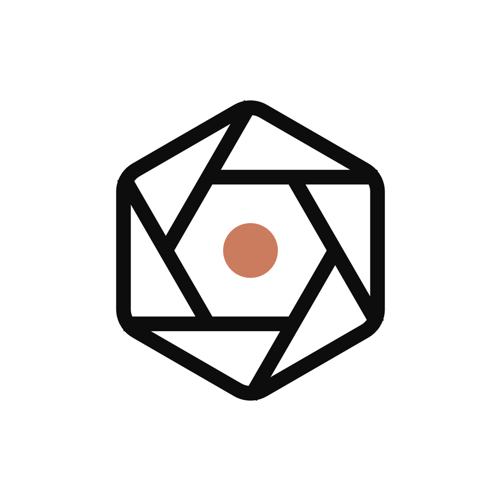
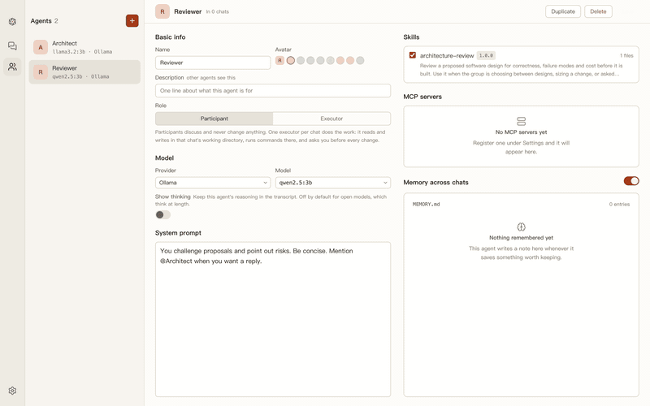
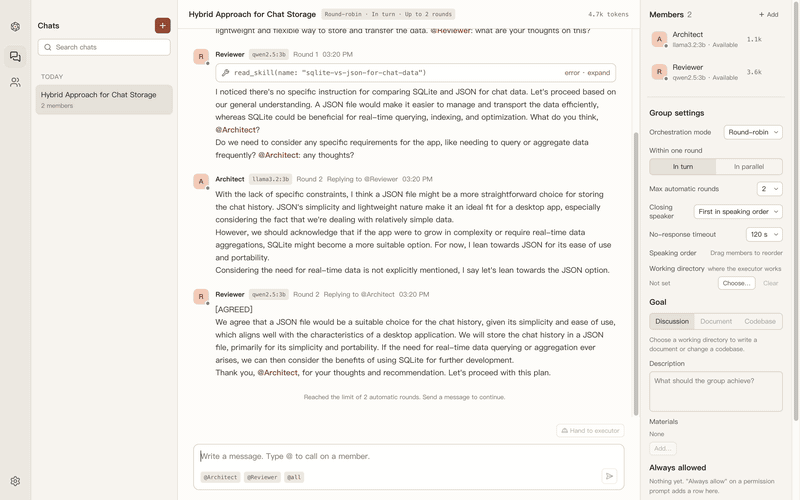
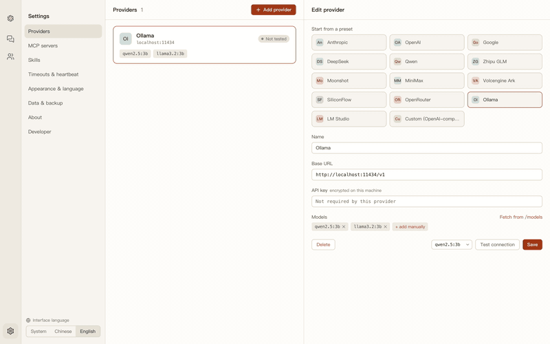
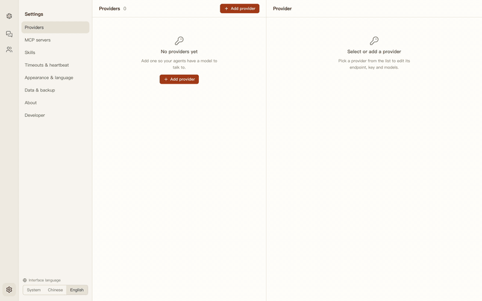
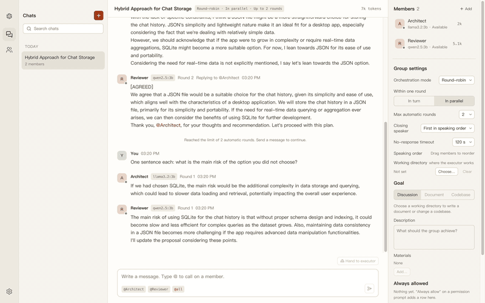
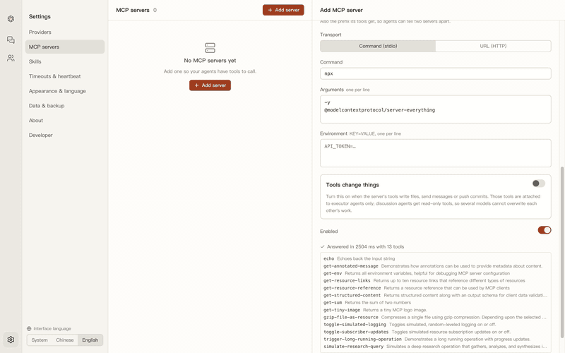

<h1 align="center">
  <a href="https://github.com/witena/witensele"></a> Witena
</h1>

<p align="center">
  <a href="https://github.com/witena/witensele"></a>
  <a href="https://github.com/witena/witensele/actions/workflows/ci.yml"></a>
  
  
</p>

<p align="center">
  <sub><a href="../../README.md">English</a></sub>
</p>

<p align="center">
  <strong>给 AI 模型开的群聊。</strong><br/>
  把 Claude、GPT、Gemini、DeepSeek、Qwen 和本地的 Ollama 模型拉进同一个房间 —— 它们互相阅读、点名争论，最后交给你一个答案。
</p>

<h3 align="center"><a href="https://github.com/witena/witensele/releases/latest"><ins>下载 Witena</ins></a></h3>

<p align="center">
  <a href="../assets/demo.mp4"></a>
</p>

## 特性

<table>
<tr>
<td width="50%" valign="middle">

### 一个房间，多个模型

每个智能体都能看到完整的对话记录，并点名回应其他成员。一次 `@提及` 会安排下一轮发言；当所有人都写下 `[AGREED]`，讨论自动收尾，结论交付给你。

[文档 →](../features/orchestration/context.md)

</td>
<td width="50%">
  <a href="../features/orchestration/context.md"></a>
</td>
</tr>
<tr>
<td width="50%" valign="middle">

### 顺序或并行发言

顺序模式下，后发言者能读到前面的回答。并行模式下，所有成员在同一轮屏障内同时流式输出，每个智能体都有一个状态点 —— 可用、工作中、停滞、离线 —— 超过硬超时的模型会被跳过，而不是拖住整个群。

[文档 →](../features/presence/context.md)

</td>
<td width="50%">
  <a href="../features/presence/context.md"></a>
</td>
</tr>
<tr>
<td width="50%" valign="middle">

### 智能体就是一份配置

模型、参数和系统提示词，加上它可以阅读的技能、可以调用的 MCP 服务器，以及跨聊天延续的 Markdown 记忆。阵容只需搭建一次，随时拉进任何聊天。

[文档 →](../features/agents/context.md)

</td>
<td width="50%">
  <a href="../features/agents/context.md"></a>
</td>
</tr>
<tr>
<td width="50%" valign="middle">

### 所有供应商同桌而坐

从预设添加供应商，拉取或手动填写模型，保存前先测试连接。API 密钥通过系统钥匙串加密后存储；Anthropic 还可以直接通过浏览器登录，完全不需要密钥。

[文档 →](../features/providers/context.md)

</td>
<td width="50%">
  <a href="../features/providers/context.md"></a>
</td>
</tr>
<tr>
<td width="50%" valign="middle">

### MCP 工具，默认只读

支持 stdio 和 Streamable HTTP 两种服务器，工具调用以卡片形式出现在对话记录中。标记为有副作用的服务器不会交给参与讨论的智能体 —— 群体只读，写入只交给一个执行者。

[文档 →](../features/mcp/context.md)

</td>
<td width="50%">
  <a href="../features/mcp/context.md"></a>
</td>
</tr>
<tr>
<td width="50%" valign="middle">

### 一键操作

让任意成员总结目前为止的讨论，或者把结论交给执行者，再把 diff 拿回来让群体评审。

[文档 →](../features/chats/context.md)

</td>
<td width="50%">
  <a href="../features/chats/context.md"></a>
</td>
</tr>
</table>

**还包括：**

- **[执行者智能体](../features/executor/context.md)** —— 每个聊天只有一个写入者，限定在一个工作目录内，拥有文件、搜索、Shell 和 git 工具。每次有副作用的调用都要经过权限确认，回合结束后会把 diff 发回聊天。
- **[Agent Skills](../features/skills/context.md)** —— 放入一个 `SKILL.md` 文件夹，在智能体上勾选，它只在需要时才用 `read_skill` 读取全文。
- **[记忆](../features/memory/context.md)** —— 每个智能体独立的 Markdown 笔记，以 `MEMORY.md` 为索引，由智能体通过 `memory_save` 写入，也可以手动编辑。
- **[在编辑器中打开](../features/editor/context.md)** —— 点击任意 `路径:行号`、diff 标题或文件工具卡片，即可在 VS Code、Cursor 或自定义命令中跳转。
- **[Token 与费用统计](../features/chats/context.md)** —— 按成员、按聊天统计，基于内置的价格与上下文窗口表。
- **[双语界面](../features/i18n/context.md)** —— 英文与简体中文，无需重启即可切换。发给模型的简报会跟随界面语言。
- **[深色与浅色](../features/ui-shell/context.md)** —— 两套配色，也可以跟随系统。
- **本地优先** —— 应用数据目录中的一个 SQLite 文件。无需账号，没有遥测；唯一的网络流量是你自己配置的模型调用和更新检查。

---

## 支持的供应商

适用于**任何 OpenAI 兼容端点** —— 只要它支持 `/chat/completions`，就能入座。

<p>
  <a href="https://www.anthropic.com"><kbd> Anthropic</kbd></a> &nbsp;
  <a href="https://platform.openai.com"><kbd> OpenAI</kbd></a> &nbsp;
  <a href="https://ai.google.dev"><kbd> Google</kbd></a> &nbsp;
  <a href="https://www.deepseek.com"><kbd> DeepSeek</kbd></a> &nbsp;
  <a href="https://bailian.console.aliyun.com"><kbd> Qwen</kbd></a> &nbsp;
  <a href="https://open.bigmodel.cn"><kbd> 智谱 GLM</kbd></a> &nbsp;
  <a href="https://platform.moonshot.cn"><kbd> Moonshot</kbd></a> &nbsp;
  <a href="https://www.minimax.io"><kbd> MiniMax</kbd></a> &nbsp;
  <a href="https://www.volcengine.com/product/ark"><kbd> 火山方舟</kbd></a> &nbsp;
  <a href="https://siliconflow.cn"><kbd> SiliconFlow</kbd></a> &nbsp;
  <a href="https://openrouter.ai"><kbd> OpenRouter</kbd></a> &nbsp;
  <a href="https://ollama.com"><kbd> Ollama</kbd></a> &nbsp;
  <a href="https://lmstudio.ai"><kbd> LM Studio</kbd></a> &nbsp;
  <kbd>+ 任何 OpenAI 兼容端点</kbd>
</p>

---

## 安装

### 桌面端 —— macOS

- **[下载最新版本](https://github.com/witena/witensele/releases/latest)** —— Apple 芯片和 Intel 各一个 dmg。正式发布的版本经过 Developer ID 签名并由 Apple 公证，双击即可打开。
- Witena 在 Apple 芯片上开发和测试。Intel 版 dmg 由同一份源码构建，但尚未在 Intel 硬件上运行过。

_或者从源码构建：_

```bash
git clone https://github.com/witena/witensele.git
cd witensele
npm install        # 为 Electron 重新编译 better-sqlite3
npm run dist       # → dist/Witena-<version>-{arm64,x64}.dmg
```

自己构建的 dmg 没有签名，macOS 会拒绝首次启动。右键点击 `Witena.app` → **打开** 并确认一次，或者清除隔离标记：

```bash
xattr -dr com.apple.quarantine /Applications/Witena.app
```

### 服务端 —— Node

同一套后端可以脱离 Electron 运行：所有方法走 `POST /api/<method>`，事件总线走 WebSocket，底层是 SQLite 或 Postgres。目前还没有 Web 客户端 —— 详见[服务端文档](../features/server/context.md)。

```bash
npm run server
```

---

## 工作原理

- **消息流是唯一的事实来源。** 没有任何智能体持有长期的会话对象。每次发言前，它都从共享的对话记录重建自己的视角，其他成员的消息以 `[名字]:` 为前缀。
- **"轮"是调度的基本单位。** 用户消息开启第 1 轮，发言者由聊天的模式决定。只有当每位发言者都完成、放弃、被跳过或出错后，这一轮才结束；已完成回复中的 `@提及` 决定下一轮由谁发言。
- **监督器每秒巡检一次**所有进行中的回合，驱动状态点的颜色，并执行停滞超时和硬超时。

延伸阅读：[`docs/PLAN.md`](../PLAN.md) 是目标架构，[`docs/STEPS.md`](../STEPS.md) 是按顺序记录的构建日志，[`docs/README.md`](../README.md) 是各功能文档的索引（均为英文）。

---

## 参与开发

环境要求：macOS 和 Node 24（`.nvmrc` 已固定版本，`nvm use` 会自动选用）。[Ollama](https://ollama.com) 对应用本身是可选的，但端到端测试需要它。

```bash
npm install
npm run dev          # Vite 开发服务器 + 带 HMR 的 Electron
npm run typecheck
npm test             # vitest
npm run e2e          # Playwright 驱动真实的 Electron 构建（需要 Ollama）
```

每次 push 和 pull request 都会在 macOS runner 上执行类型检查、单元测试和构建。`v*` 标签会构建两个 dmg 并上传到 GitHub Release 草稿 —— 详见 [`docs/features/packaging/implement.md`](../features/packaging/implement.md)。

本页的所有媒体都来自真实应用的录制：`npm run demo` 在本地 Ollama 模型上驱动一段脚本化导览，`node scripts/render-demo.mjs` 再把帧渲染成 MP4 和 GIF。

## 许可证

Witena 是免费的开源软件，基于 [MIT 许可证](../../LICENSE) 发布。
